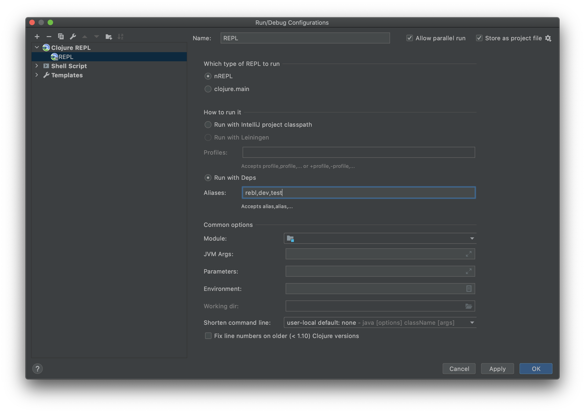

# REBL Middleware

A small middleware to be able to use [Cognitect's REBL](https://docs.datomic.com/cloud/other-tools/REBL.html) together with [Cursive](https://cursive-ide.com)'s default nREPL.

## Installation
Add following alias to your `deps.edn` file.

```clojure
...

:aliases { ...

          :rebl {:extra-deps {com.cognitect/rebl              {:mvn/version "0.9.242"}
                              furkan3ayraktar/rebl-middleware {:git/url "https://github.com/furkan3ayraktar/rebl-middleware"
                                                               :sha "LATEST_COMMIT_SHA_FROM_REPO"}}}} 

...
```

If you do not have a `.nrepl.edn` file, create that file in the root of your project and add the following content.

```clojure
{:middleware [com.furkanbayraktar.rebl.middleware/wrap-rebl]}
```

Next, you can create a new run configuration in Cursive (or update an existing one) by adding rebl alias to your existing aliases. An example run configuration might look like this:



Once you run this configuration and the REPL is ready, you can run the following to start REBL UI:

```clojure
(require '[cognitect.rebl :as rebl])

(rebl/ui)
```

## License

Distributed under the [Eclipse Public License 1.0](http://opensource.org/licenses/eclipse-1.0.php), the same as Clojure.
